# Architecture

## The shape of the thing

A Broapp application is one operating-system process. It binds a loopback
socket, serves one HTML document over it, and opens the user's browser at that
document. The browser then talks back to the same process over a WebSocket on
the same origin. When you compile it, the HTML document is inside the
executable, and so is the JavaScript runtime.

Nothing leaves the machine. There is no server to run, no container, no
packaged Chromium.

## Four layers, and who owns what

**Brobridge** owns the connection. The trust fence that checks `Host` and
`Origin`, the one-time launch token, the HMAC-signed session cookie, the frame
codec, stream multiplexing, credit-based flow control, and resume after a
dropped socket are all in Brobridge and are used unchanged. Broapp does not
patch, fork, or vendor any of it, and does not weaken a default to make
development convenient.

**Broapp** owns the developer experience. The contract and its validation, the
error boundary, the stream framing, the lifecycle, the build, the generator.

**Your application** owns the operations and the interface.

**The AI layer**, when an application turns it on, owns the fourth. It is
optional, it is host-only, and it is provider-independent: settings and key
storage, the context an application chooses to expose, tools derived from the
contract, and the confirmation step before a tool changes anything. It runs in
the host process because the browser cannot reach a provider — the page's
content-security policy allows `'self'` and loopback and nothing else — and
because a key in a page is a key that has been published. An application that
does not call `createAi` carries none of it. See [the AI layer](ai.md).

This split is why the interesting security properties are not Broapp's to get
wrong. It is also why Broapp is small.

## The constraint that decides the packaging

Brobridge's route table is exactly three entries: `/`, `/ws`, `/rpc`. There is
no static file route — deliberately, so that nothing about the bridge ever
touches the filesystem in response to a request.

That single fact settles how a Broapp UI is packaged: it must be **one
document**, with its CSS and JavaScript inline, because `<script src="/app.js">`
would 404. `broapp build` therefore bundles the browser entry point, inlines the
result, and refuses to emit a page that loads anything from off-origin.

It suits a single-file executable well. One document is one
`import … with { type: "text" }`, which Bun inlines into the compiled binary.
There is no asset manifest, nothing resolved relative to the executable, and
nothing to break when the file is moved.

The same constraint is why there is no code splitting: a second chunk would need
a second route. `broapp build` fails if the bundle produces one.

## The contract

A contract is data: a table of operations and streams, each with schemas for its
input and output. Both sides import it; neither imports the other. Because it
holds no implementation, a bundler following the browser's import of the
contract does not pull the host in with it — which is what keeps host code, host
configuration and host secrets out of the browser bundle. There is a test that
asserts a browser bundle importing `broapp/host` fails the build.

Underneath, a contract maps onto Brobridge's existing surface and nothing more.
An operation `"notes.list"` is exactly `bridge.expose("notes", { list })` on the
host and `bridge.call("notes.list", input)` in the browser. There is no second
dispatch path, no parallel protocol, and nothing to keep in step.

## Validation and the error boundary

Input is validated on the host, always, before a handler sees it. The browser
also validates before sending — but only as a convenience: the host's check is
the boundary, and a test bypasses the client to prove it.

Errors cross the boundary in exactly two ways. An error a handler raises
deliberately with `PublicError` keeps its message. Everything else is logged on
the host, with its stack, and reaches the browser as a fixed sentence. Broapp
does not have to redact anything for the second case — Brobridge already reduces
a non-`BridgeError` throw to `"internal error"` — so Broapp gets out of the way
and lets it happen.

## Streams

Brobridge streams carry bytes, not messages. A chunk delivered to a consumer may
hold two events, half an event, or the tail of one and the head of the next.
Broapp frames events as newline-delimited JSON rather than assuming one chunk is
one event, because the assumption holds in testing and fails in production.

Cancellation is the part worth reading carefully. It is covered in
[streaming.md](streaming.md); the short version is that abandoning an async
iterator does **not** cancel the stream underneath it, so the browser must call
`cancel()` explicitly, and the host learns about it through `stream.closed`
rejecting.

## Lifecycle

Two modes, both explicit. `interactive` (the default) exits shortly after the
last browser tab detaches, unless work is running. `background` keeps going
until it is stopped.

"Attached" is not "a session exists": Brobridge retains a session after its
socket drops so a reconnecting tab can resume, so counting sessions would keep
an interactive host alive for a minute after the last tab closed. Attachment is
`endpoint.state === "open"`. Attachment is also recorded from Brobridge's
session hook rather than by polling, so a tab that connects and closes between
two polls is not mistaken for a browser that never arrived.

See [lifecycle.md](lifecycle.md).

## What Broapp adds, in one list

- A generator that refuses unsafe destinations and never overwrites your files.
- A typed contract, with runtime validation on the host.
- NDJSON framing over Brobridge's byte streams.
- Cancellation surfaced as an `AbortSignal`.
- A single-document build with a hash-pinned CSP and an off-origin check.
- Single-file compilation with the UI embedded, for six targets.
- Two documented lifecycle modes with real shutdown.
- A per-user data directory, resolved once, overridable.
- One development command that does not spawn a tab per save.
- An optional, host-only AI layer: settings, key storage, context, tools derived from the contract, and confirmation before anything changes.
